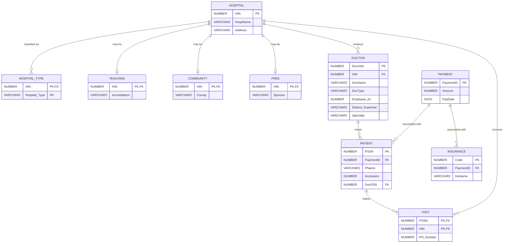

# Hospital Database Entity-Relationship Diagram

## Design Notes

- `VISIT` resolves the many-to-many relationship between patients and hospitals.
- `HOSPITAL_TYPE` stores the multivalued hospital classification.
- `TEACHING`, `COMMUNITY`, and `FREE` represent overlapping hospital specializations.
- `DocType` distinguishes general practitioners from specialists within the `DOCTOR` table.
- `PaymentID` is a surrogate key used to associate payment records with patients or insurance providers.